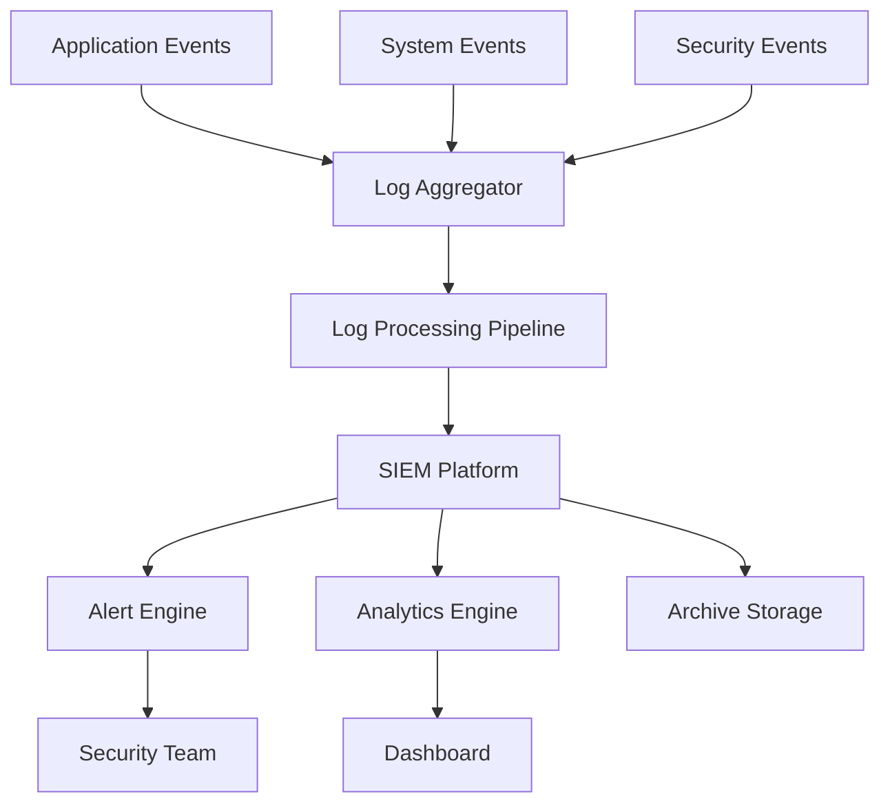
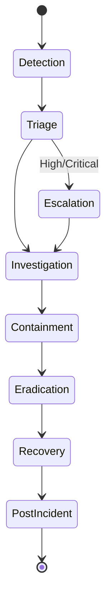

# Security Monitoring Enhancement Plan
## Advanced Security Monitoring and Incident Response for 4Seasons Application

**Version:** 1.0
**Last Updated:** September 14, 2025
**Framework:** NIST Cybersecurity Framework 2.0

---

## Table of Contents
1. [Security Event Monitoring](#security-event-monitoring)
2. [Anomaly Detection](#anomaly-detection)
3. [Incident Response Procedures](#incident-response-procedures)
4. [Security Metrics Dashboard](#security-metrics-dashboard)
5. [Alerting Configuration](#alerting-configuration)
6. [Log Analysis](#log-analysis)
7. [Compliance Reporting](#compliance-reporting)
8. [Threat Intelligence Integration](#threat-intelligence-integration)

---

## Security Event Monitoring

### Event Collection Architecture



### Critical Security Events to Monitor

#### Authentication Events

```typescript
// Enhanced authentication logging
// Location: server/auth.ts

interface AuthEvent {
  timestamp: Date;
  eventType: 'LOGIN_SUCCESS' | 'LOGIN_FAILURE' | 'LOGOUT' | 'PASSWORD_RESET' | 'ACCOUNT_LOCKED';
  userId?: string;
  email: string;
  ip: string;
  userAgent: string;
  location?: GeoLocation;
  riskScore: number;
  metadata: {
    failureReason?: string;
    attemptNumber?: number;
    mfaUsed?: boolean;
    sessionId?: string;
  };
}

export const logAuthEvent = async (event: AuthEvent) => {
  // Enrich with geolocation
  event.location = await getGeoLocation(event.ip);

  // Calculate risk score
  event.riskScore = calculateRiskScore(event);

  // Log to security channel
  securityLogger.info('AUTH_EVENT', event);

  // Real-time alerting for high-risk events
  if (event.riskScore > 70) {
    await sendSecurityAlert(event);
  }

  // Store for analysis
  await storeSecurityEvent(event);
};
```

#### Authorization Events

```typescript
// Authorization monitoring
// Location: server/middleware/auth.middleware.ts

interface AuthzEvent {
  timestamp: Date;
  eventType: 'ACCESS_GRANTED' | 'ACCESS_DENIED' | 'PRIVILEGE_ESCALATION';
  userId: string;
  resource: string;
  action: string;
  result: boolean;
  reason?: string;
  context: {
    requestedPermissions: string[];
    userPermissions: string[];
    roleHierarchy: string[];
  };
}

export const logAuthzEvent = async (event: AuthzEvent) => {
  // Detect privilege escalation attempts
  if (event.eventType === 'ACCESS_DENIED') {
    await detectPrivilegeEscalation(event);
  }

  securityLogger.info('AUTHZ_EVENT', event);
};
```

#### Data Access Events

```typescript
// Sensitive data access monitoring
// Location: server/database/security.ts

interface DataAccessEvent {
  timestamp: Date;
  userId: string;
  dataType: 'PII' | 'FINANCIAL' | 'HEALTH' | 'CREDENTIALS';
  operation: 'READ' | 'WRITE' | 'DELETE' | 'EXPORT';
  recordCount: number;
  tableName: string;
  query: string;
  duration: number;
  anomalyScore: number;
}

export const logDataAccess = async (event: DataAccessEvent) => {
  // Detect unusual access patterns
  event.anomalyScore = await detectDataAnomalies(event);

  // Alert on suspicious behavior
  if (event.anomalyScore > 80 || event.recordCount > 1000) {
    await alertDataExfiltration(event);
  }

  auditLogger.info('DATA_ACCESS', event);
};
```

### Event Correlation Rules

```yaml
# correlation-rules.yaml
rules:
  - name: brute_force_detection
    description: Detect brute force attacks
    condition:
      - event_type: LOGIN_FAILURE
      - count: "> 5"
      - time_window: 5m
      - group_by: [ip, email]
    action:
      - alert: critical
      - block_ip: true
      - notify: security_team

  - name: account_takeover_detection
    description: Detect potential account takeover
    condition:
      - event_type: LOGIN_SUCCESS
      - new_location: true
      - new_device: true
      - time_since_last_login: "> 30d"
    action:
      - alert: high
      - require_mfa: true
      - email_user: true

  - name: data_exfiltration_detection
    description: Detect potential data theft
    condition:
      - operation: [READ, EXPORT]
      - record_count: "> 1000"
      - time_window: 1h
      - unusual_time: true
    action:
      - alert: critical
      - suspend_session: true
      - capture_forensics: true
```

---

## Anomaly Detection

### Machine Learning-Based Detection

```python
# anomaly_detection.py
import numpy as np
from sklearn.ensemble import IsolationForest
from sklearn.preprocessing import StandardScaler

class SecurityAnomalyDetector:
    def __init__(self):
        self.model = IsolationForest(
            contamination=0.1,
            random_state=42
        )
        self.scaler = StandardScaler()

    def train(self, historical_data):
        """Train on normal behavior patterns"""
        features = self.extract_features(historical_data)
        scaled_features = self.scaler.fit_transform(features)
        self.model.fit(scaled_features)

    def detect_anomaly(self, event):
        """Detect if event is anomalous"""
        features = self.extract_features([event])
        scaled_features = self.scaler.transform(features)
        prediction = self.model.predict(scaled_features)
        anomaly_score = self.model.score_samples(scaled_features)

        return {
            'is_anomaly': prediction[0] == -1,
            'anomaly_score': abs(anomaly_score[0]) * 100,
            'features': features[0]
        }

    def extract_features(self, events):
        """Extract behavioral features from events"""
        features = []
        for event in events:
            features.append([
                event['hour_of_day'],
                event['day_of_week'],
                event['request_count'],
                event['unique_ips'],
                event['failed_auth_ratio'],
                event['data_volume'],
                event['session_duration'],
                event['api_call_frequency']
            ])
        return np.array(features)
```

### Behavioral Analysis Rules

```typescript
// Behavioral anomaly detection
// Location: server/services/anomaly-detector.ts

interface UserBehavior {
  userId: string;
  normalLoginTimes: number[];  // Hour of day
  normalLocations: string[];
  normalDevices: string[];
  avgSessionDuration: number;
  avgRequestsPerSession: number;
  commonEndpoints: string[];
}

export class BehaviorAnalyzer {
  async analyzeLogin(userId: string, loginEvent: LoginEvent): Promise<AnomalyResult> {
    const userBehavior = await getUserBehavior(userId);
    const anomalies: string[] = [];
    let riskScore = 0;

    // Time-based anomaly
    const hourOfDay = new Date(loginEvent.timestamp).getHours();
    if (!userBehavior.normalLoginTimes.includes(hourOfDay)) {
      anomalies.push('unusual_login_time');
      riskScore += 20;
    }

    // Location-based anomaly
    if (!userBehavior.normalLocations.includes(loginEvent.location)) {
      anomalies.push('new_location');
      riskScore += 30;
    }

    // Device-based anomaly
    if (!userBehavior.normalDevices.includes(loginEvent.deviceId)) {
      anomalies.push('new_device');
      riskScore += 25;
    }

    // Impossible travel detection
    const travelAnomaly = await detectImpossibleTravel(userId, loginEvent);
    if (travelAnomaly) {
      anomalies.push('impossible_travel');
      riskScore += 50;
    }

    return {
      anomalies,
      riskScore,
      recommendation: riskScore > 70 ? 'BLOCK' : riskScore > 40 ? 'MFA_REQUIRED' : 'ALLOW'
    };
  }
}
```

---

## Incident Response Procedures

### Incident Response Workflow



### Incident Response Runbooks

#### 1. Suspected Account Takeover

```markdown
## Account Takeover Response Runbook

### Detection Triggers
- Multiple failed login attempts followed by success
- Login from new location/device
- Unusual activity patterns post-login

### Immediate Actions (0-5 minutes)
1. **Suspend affected account**
   ```bash
   curl -X POST /api/admin/users/{userId}/suspend
   ```

2. **Terminate active sessions**
   ```bash
   redis-cli DEL sess:*{userId}*
   ```

3. **Capture forensic data**
   ```bash
   ./scripts/capture-forensics.sh {userId}
   ```

### Investigation (5-30 minutes)
1. Review authentication logs
2. Check for data access/modifications
3. Identify attack vector
4. Check for lateral movement

### Containment (30-60 minutes)
1. Reset user credentials
2. Enable MFA if not already
3. Block suspicious IPs
4. Review similar accounts for compromise

### Recovery
1. Restore account with new credentials
2. Notify user with security recommendations
3. Monitor account for 48 hours

### Post-Incident
1. Document timeline and actions
2. Update security controls
3. Share threat intelligence
```

#### 2. Data Exfiltration Attempt

```markdown
## Data Exfiltration Response Runbook

### Detection Triggers
- Large data queries (>1000 records)
- Unusual export activity
- Off-hours data access
- Rapid sequential queries

### Immediate Actions (0-2 minutes)
1. **Block data access**
   ```typescript
   await blockUserDataAccess(userId);
   ```

2. **Capture query logs**
   ```sql
   SELECT * FROM query_logs
   WHERE user_id = ?
   AND timestamp > NOW() - INTERVAL '1 hour';
   ```

3. **Alert security team**
   ```javascript
   sendAlert({
     severity: 'CRITICAL',
     type: 'DATA_EXFILTRATION',
     userId,
     dataVolume
   });
   ```

### Investigation (2-15 minutes)
1. Identify data accessed
2. Determine sensitivity level
3. Check for data transmission
4. Review user authorization

### Containment (15-30 minutes)
1. Revoke database access
2. Disable API keys
3. Block network egress
4. Preserve evidence

### Recovery
1. Audit all data access
2. Notify compliance team
3. Implement additional monitoring
4. Review data access policies
```

### Incident Severity Matrix

| Severity | Response Time | Escalation | Examples |
|----------|--------------|------------|----------|
| Critical | < 15 min | CISO, Legal | Data breach, ransomware |
| High | < 1 hour | Security Manager | Account takeover, DDoS |
| Medium | < 4 hours | Security Team | Suspicious activity |
| Low | < 24 hours | On-call Engineer | Failed attacks |

---

## Security Metrics Dashboard

### Real-time Security KPIs

```typescript
// Security metrics collection
// Location: server/services/security-metrics.ts

export interface SecurityMetrics {
  // Authentication Metrics
  authMetrics: {
    successRate: number;
    failureRate: number;
    avgLoginTime: number;
    mfaAdoptionRate: number;
    passwordResetRate: number;
    accountLockoutRate: number;
  };

  // Threat Metrics
  threatMetrics: {
    blockedAttacks: number;
    detectedAnomalies: number;
    maliciousIPs: number;
    suspiciousActivities: number;
    threatsPerHour: number;
  };

  // Vulnerability Metrics
  vulnMetrics: {
    criticalVulns: number;
    highVulns: number;
    mediumVulns: number;
    lowVulns: number;
    avgRemediationTime: number;
    patchComplianceRate: number;
  };

  // Compliance Metrics
  complianceMetrics: {
    owaspCompliance: number;
    gdprCompliance: number;
    auditLogCoverage: number;
    encryptionCoverage: number;
  };
}

export const collectSecurityMetrics = async (): Promise<SecurityMetrics> => {
  const metrics = await Promise.all([
    collectAuthMetrics(),
    collectThreatMetrics(),
    collectVulnMetrics(),
    collectComplianceMetrics()
  ]);

  return {
    authMetrics: metrics[0],
    threatMetrics: metrics[1],
    vulnMetrics: metrics[2],
    complianceMetrics: metrics[3]
  };
};
```

### Dashboard Configuration

```yaml
# dashboard-config.yaml
dashboards:
  - name: Executive Security Dashboard
    refresh: 5m
    widgets:
      - type: scorecard
        metric: overall_security_score
        threshold: { good: 85, warning: 70, critical: 50 }

      - type: timeline
        metric: security_events
        period: 24h

      - type: heatmap
        metric: threat_geography

      - type: gauge
        metrics:
          - auth_success_rate
          - mfa_adoption
          - patch_compliance

  - name: SOC Dashboard
    refresh: 30s
    widgets:
      - type: live_feed
        source: security_events

      - type: alert_queue
        priorities: [critical, high]

      - type: threat_map
        data_source: threat_intelligence

      - type: metric_grid
        metrics:
          - active_incidents
          - mttr
          - false_positive_rate
```

---

## Alerting Configuration

### Multi-Channel Alerting

```typescript
// Alert configuration
// Location: server/services/alerting.ts

interface AlertConfig {
  severity: 'LOW' | 'MEDIUM' | 'HIGH' | 'CRITICAL';
  channels: AlertChannel[];
  escalation: EscalationPolicy;
  deduplication: boolean;
  grouping: string[];
}

interface AlertChannel {
  type: 'EMAIL' | 'SMS' | 'SLACK' | 'PAGERDUTY' | 'WEBHOOK';
  recipients: string[];
  template: string;
  conditions?: AlertCondition[];
}

const alertConfigs: Record<string, AlertConfig> = {
  BRUTE_FORCE: {
    severity: 'HIGH',
    channels: [
      { type: 'SLACK', recipients: ['#security-alerts'], template: 'brute_force' },
      { type: 'EMAIL', recipients: ['security@4seasons.com'], template: 'security_alert' }
    ],
    escalation: {
      delayMinutes: 15,
      target: 'PAGERDUTY'
    },
    deduplication: true,
    grouping: ['source_ip', 'target_account']
  },

  DATA_EXFILTRATION: {
    severity: 'CRITICAL',
    channels: [
      { type: 'PAGERDUTY', recipients: ['security-oncall'], template: 'critical' },
      { type: 'SMS', recipients: ['+1234567890'], template: 'urgent' },
      { type: 'SLACK', recipients: ['#incident-response'], template: 'data_breach' }
    ],
    escalation: {
      delayMinutes: 5,
      target: 'CISO'
    },
    deduplication: false,
    grouping: []
  }
};

export class AlertManager {
  async sendAlert(event: SecurityEvent): Promise<void> {
    const config = alertConfigs[event.type];

    if (this.shouldDeduplicate(event, config)) {
      return;
    }

    for (const channel of config.channels) {
      await this.sendToChannel(event, channel);
    }

    this.scheduleEscalation(event, config.escalation);
  }

  private async sendToChannel(event: SecurityEvent, channel: AlertChannel): Promise<void> {
    switch (channel.type) {
      case 'SLACK':
        await this.sendSlackAlert(event, channel);
        break;
      case 'EMAIL':
        await this.sendEmailAlert(event, channel);
        break;
      case 'SMS':
        await this.sendSMSAlert(event, channel);
        break;
      case 'PAGERDUTY':
        await this.sendPagerDutyAlert(event, channel);
        break;
      case 'WEBHOOK':
        await this.sendWebhookAlert(event, channel);
        break;
    }
  }
}
```

### Alert Templates

```typescript
// Alert message templates
const alertTemplates = {
  brute_force: {
    slack: {
      text: '🚨 Brute Force Attack Detected',
      blocks: [
        {
          type: 'section',
          text: {
            type: 'mrkdwn',
            text: `*Target Account:* ${event.targetAccount}\n*Source IP:* ${event.sourceIP}\n*Attempts:* ${event.attemptCount}`
          }
        },
        {
          type: 'actions',
          elements: [
            { type: 'button', text: 'Block IP', action_id: 'block_ip' },
            { type: 'button', text: 'Lock Account', action_id: 'lock_account' },
            { type: 'button', text: 'View Details', url: event.detailsUrl }
          ]
        }
      ]
    }
  }
};
```

---

## Log Analysis

### Log Processing Pipeline

```python
# log_processor.py
import re
from datetime import datetime
from typing import Dict, List

class LogProcessor:
    def __init__(self):
        self.patterns = {
            'sql_injection': re.compile(r"(\bUNION\b|\bSELECT\b.*\bFROM\b|\bDROP\b|\bDELETE\b.*\bFROM\b)", re.I),
            'xss_attempt': re.compile(r"(<script|javascript:|onerror=|onclick=)", re.I),
            'path_traversal': re.compile(r"(\.\./|\.\.\\|%2e%2e%2f)"),
            'command_injection': re.compile(r"(;|\||`|\$\(|\${)")
        }

    def process_log_entry(self, log_entry: str) -> Dict:
        """Process single log entry for security events"""
        parsed = self.parse_log_entry(log_entry)

        # Detect attack patterns
        threats = self.detect_threats(parsed)

        # Extract metrics
        metrics = self.extract_metrics(parsed)

        # Enrich with context
        enriched = self.enrich_log_data(parsed)

        return {
            'timestamp': parsed['timestamp'],
            'event_type': parsed['event_type'],
            'threats': threats,
            'metrics': metrics,
            'enriched_data': enriched,
            'risk_score': self.calculate_risk_score(threats, metrics)
        }

    def detect_threats(self, parsed_log: Dict) -> List[str]:
        """Detect security threats in log data"""
        threats = []

        request_data = parsed_log.get('request', '')

        for threat_name, pattern in self.patterns.items():
            if pattern.search(request_data):
                threats.append(threat_name)

        # Check for authentication anomalies
        if parsed_log.get('status_code') == 401:
            if parsed_log.get('failed_attempts', 0) > 5:
                threats.append('brute_force')

        return threats

    def extract_metrics(self, parsed_log: Dict) -> Dict:
        """Extract security metrics from logs"""
        return {
            'response_time': parsed_log.get('response_time', 0),
            'request_size': parsed_log.get('request_size', 0),
            'response_size': parsed_log.get('response_size', 0),
            'error_rate': self.calculate_error_rate(parsed_log),
            'threat_score': len(self.detect_threats(parsed_log)) * 20
        }
```

### Log Correlation Engine

```typescript
// Log correlation for complex attack detection
// Location: server/services/log-correlation.ts

export class LogCorrelationEngine {
  private correlationWindow = 5 * 60 * 1000; // 5 minutes
  private eventBuffer: Map<string, SecurityEvent[]> = new Map();

  async correlateEvents(newEvent: SecurityEvent): Promise<CorrelationResult[]> {
    const correlations: CorrelationResult[] = [];

    // Store event in buffer
    this.addToBuffer(newEvent);

    // Check for attack patterns
    const patterns = [
      this.detectReconnaissancePattern(newEvent),
      this.detectLateralMovement(newEvent),
      this.detectDataExfiltrationPattern(newEvent),
      this.detectPrivilegeEscalationChain(newEvent)
    ];

    for (const pattern of patterns) {
      if (pattern) {
        correlations.push(pattern);
      }
    }

    return correlations;
  }

  private detectReconnaissancePattern(event: SecurityEvent): CorrelationResult | null {
    const relatedEvents = this.getRelatedEvents(event.sourceIP);

    const scanIndicators = relatedEvents.filter(e =>
      e.type === '404_ERROR' ||
      e.type === 'INVALID_ENDPOINT' ||
      e.type === 'DIRECTORY_TRAVERSAL'
    );

    if (scanIndicators.length > 10) {
      return {
        pattern: 'RECONNAISSANCE',
        confidence: Math.min(scanIndicators.length * 5, 95),
        relatedEvents: scanIndicators,
        recommendation: 'Block IP and investigate'
      };
    }

    return null;
  }

  private detectLateralMovement(event: SecurityEvent): CorrelationResult | null {
    const userEvents = this.getRelatedEvents(event.userId);

    const suspiciousAccess = userEvents.filter(e => {
      const timeDiff = event.timestamp - e.timestamp;
      return (
        e.type === 'PRIVILEGE_CHANGE' ||
        e.type === 'UNUSUAL_ACCESS' ||
        (e.type === 'LOGIN_SUCCESS' && timeDiff < 60000)
      );
    });

    if (suspiciousAccess.length > 3) {
      return {
        pattern: 'LATERAL_MOVEMENT',
        confidence: 75,
        relatedEvents: suspiciousAccess,
        recommendation: 'Isolate account and review access'
      };
    }

    return null;
  }
}
```

---

## Compliance Reporting

### Automated Compliance Reports

```typescript
// Compliance report generator
// Location: server/services/compliance-reporter.ts

export class ComplianceReporter {
  async generateReport(standard: 'OWASP' | 'GDPR' | 'SOC2' | 'ISO27001'): Promise<ComplianceReport> {
    const controls = await this.getControlsForStandard(standard);
    const evidence = await this.collectEvidence(controls);
    const gaps = await this.identifyGaps(controls, evidence);

    return {
      standard,
      reportDate: new Date(),
      overallCompliance: this.calculateCompliance(controls, evidence),
      controlStatus: controls.map(control => ({
        id: control.id,
        name: control.name,
        status: this.evaluateControl(control, evidence),
        evidence: evidence[control.id],
        gaps: gaps[control.id]
      })),
      recommendations: this.generateRecommendations(gaps),
      executiveSummary: this.generateExecutiveSummary(controls, evidence, gaps)
    };
  }

  private async collectEvidence(controls: Control[]): Promise<Evidence> {
    const evidence: Evidence = {};

    for (const control of controls) {
      evidence[control.id] = await this.gatherControlEvidence(control);
    }

    return evidence;
  }

  private async gatherControlEvidence(control: Control): Promise<ControlEvidence> {
    switch (control.type) {
      case 'TECHNICAL':
        return await this.collectTechnicalEvidence(control);
      case 'ADMINISTRATIVE':
        return await this.collectAdministrativeEvidence(control);
      case 'PHYSICAL':
        return await this.collectPhysicalEvidence(control);
    }
  }
}
```

### Compliance Dashboard

```yaml
# compliance-dashboard.yaml
compliance_metrics:
  owasp_top_10:
    - metric: injection_protection
      query: SELECT COUNT(*) FROM security_events WHERE type = 'INJECTION_BLOCKED'
      target: 100%

    - metric: authentication_strength
      query: SELECT AVG(mfa_enabled) FROM users
      target: 95%

    - metric: encryption_coverage
      query: SELECT COUNT(*) FROM data_fields WHERE encrypted = true
      target: 100%

  gdpr:
    - metric: consent_tracking
      query: SELECT COUNT(*) FROM user_consents WHERE valid = true
      target: 100%

    - metric: data_retention
      query: SELECT COUNT(*) FROM data_retention_policies WHERE compliant = true
      target: 100%

    - metric: breach_notification
      query: SELECT AVG(notification_time) FROM data_breaches
      target: < 72h
```

---

## Threat Intelligence Integration

### Threat Feed Integration

```typescript
// Threat intelligence integration
// Location: server/services/threat-intelligence.ts

interface ThreatFeed {
  name: string;
  url: string;
  apiKey?: string;
  updateFrequency: number;
  type: 'IP' | 'DOMAIN' | 'HASH' | 'PATTERN';
}

export class ThreatIntelligence {
  private feeds: ThreatFeed[] = [
    {
      name: 'AbuseIPDB',
      url: 'https://api.abuseipdb.com/api/v2/blacklist',
      apiKey: process.env.ABUSEIPDB_KEY,
      updateFrequency: 3600000, // 1 hour
      type: 'IP'
    },
    {
      name: 'OpenPhish',
      url: 'https://openphish.com/feed.txt',
      updateFrequency: 86400000, // 24 hours
      type: 'DOMAIN'
    },
    {
      name: 'URLhaus',
      url: 'https://urlhaus.abuse.ch/api/',
      updateFrequency: 3600000,
      type: 'DOMAIN'
    }
  ];

  private threatCache: Map<string, ThreatIndicator> = new Map();

  async updateThreatFeeds(): Promise<void> {
    for (const feed of this.feeds) {
      try {
        const indicators = await this.fetchFeed(feed);
        await this.processThreatIndicators(indicators, feed);
      } catch (error) {
        logger.error(`Failed to update threat feed ${feed.name}:`, error);
      }
    }
  }

  async checkThreatIndicator(indicator: string, type: string): Promise<ThreatResult> {
    const cached = this.threatCache.get(`${type}:${indicator}`);

    if (cached && !this.isExpired(cached)) {
      return {
        isThreat: true,
        confidence: cached.confidence,
        source: cached.source,
        description: cached.description
      };
    }

    // Check against live feeds if not cached
    const result = await this.queryThreatFeeds(indicator, type);

    if (result.isThreat) {
      this.threatCache.set(`${type}:${indicator}`, {
        ...result,
        timestamp: Date.now()
      });
    }

    return result;
  }

  async enrichSecurityEvent(event: SecurityEvent): Promise<EnrichedEvent> {
    const enriched: EnrichedEvent = { ...event };

    // Check IP reputation
    if (event.sourceIP) {
      enriched.ipReputation = await this.checkThreatIndicator(event.sourceIP, 'IP');
    }

    // Check domain reputation
    if (event.domain) {
      enriched.domainReputation = await this.checkThreatIndicator(event.domain, 'DOMAIN');
    }

    // Add geolocation
    if (event.sourceIP) {
      enriched.geoLocation = await this.getGeoLocation(event.sourceIP);
    }

    // Add historical context
    enriched.historicalEvents = await this.getHistoricalEvents(event);

    return enriched;
  }
}
```

### Threat Hunting Queries

```sql
-- Threat hunting SQL queries
-- Location: server/queries/threat-hunting.sql

-- Find unusual data access patterns
SELECT
  user_id,
  COUNT(DISTINCT table_name) as tables_accessed,
  SUM(record_count) as total_records,
  COUNT(DISTINCT DATE(timestamp)) as days_active,
  AVG(EXTRACT(HOUR FROM timestamp)) as avg_hour
FROM data_access_logs
WHERE timestamp > NOW() - INTERVAL '7 days'
GROUP BY user_id
HAVING
  COUNT(DISTINCT table_name) > 10 OR
  SUM(record_count) > 10000 OR
  AVG(EXTRACT(HOUR FROM timestamp)) NOT BETWEEN 8 AND 18;

-- Detect potential password spraying
SELECT
  source_ip,
  COUNT(DISTINCT username) as unique_users,
  COUNT(*) as total_attempts,
  COUNT(DISTINCT password_hash) as unique_passwords
FROM authentication_logs
WHERE
  success = false AND
  timestamp > NOW() - INTERVAL '1 hour'
GROUP BY source_ip
HAVING
  COUNT(DISTINCT username) > 5 AND
  COUNT(DISTINCT password_hash) < 3;

-- Identify privilege escalation attempts
SELECT
  user_id,
  original_role,
  requested_role,
  COUNT(*) as attempts,
  MAX(timestamp) as last_attempt
FROM authorization_logs
WHERE
  action = 'ROLE_CHANGE_DENIED' AND
  timestamp > NOW() - INTERVAL '24 hours'
GROUP BY user_id, original_role, requested_role
ORDER BY attempts DESC;
```

---

## Implementation Roadmap

### Phase 1: Foundation (Week 1-2)
1. Deploy enhanced logging infrastructure
2. Configure log aggregation
3. Set up basic alerting
4. Implement core security metrics

### Phase 2: Detection (Week 3-4)
1. Deploy anomaly detection models
2. Configure correlation rules
3. Implement behavioral analysis
4. Set up threat intelligence feeds

### Phase 3: Response (Week 5-6)
1. Create incident response runbooks
2. Configure automated responses
3. Set up escalation procedures
4. Train incident response team

### Phase 4: Optimization (Week 7-8)
1. Tune detection algorithms
2. Reduce false positives
3. Optimize alert routing
4. Enhance dashboard visualizations

---

## Success Metrics

| Metric | Current | Target | Timeline |
|--------|---------|--------|----------|
| Mean Time to Detect (MTTD) | 4 hours | 15 minutes | 3 months |
| Mean Time to Respond (MTTR) | 8 hours | 1 hour | 3 months |
| False Positive Rate | 40% | 10% | 2 months |
| Security Event Coverage | 60% | 95% | 1 month |
| Automated Response Rate | 20% | 70% | 6 months |
| Threat Intelligence Coverage | 0% | 80% | 2 months |

---

**Document Version:** 1.0
**Last Review:** September 14, 2025
**Next Review:** October 14, 2025
**Owner:** Security Operations Team
**Classification:** CONFIDENTIAL