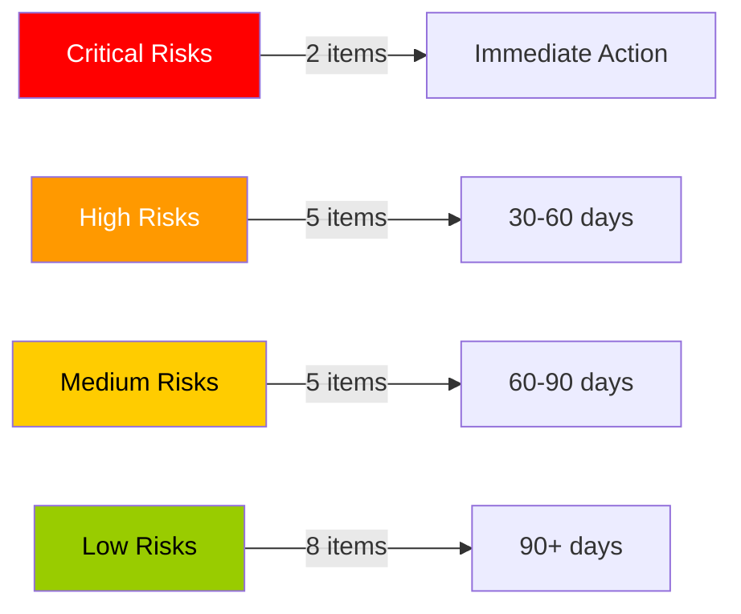
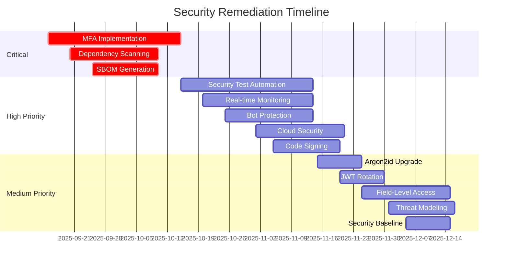

# Security Remediation Plan
## Prioritized Security Improvement Roadmap for 4Seasons Application

**Version:** 1.0
**Last Updated:** September 14, 2025
**Executive Sponsor:** CTO
**Program Manager:** Security Team Lead

---

## Executive Summary

This remediation plan addresses security gaps identified in the comprehensive security audit of the 4Seasons application. The plan is organized into four priority levels with specific timelines, resource requirements, and success criteria.

**Key Findings:**
- Overall security posture: 85% compliant with OWASP Top 10 2024
- 2 Critical gaps requiring immediate attention
- 5 High priority improvements needed
- 8 Medium/Low priority enhancements recommended

**Investment Required:**
- **Budget:** $125,000 - $175,000
- **Timeline:** 90 days for critical items
- **Resources:** 3 security engineers, 2 developers, 1 project manager

---

## Risk Assessment Summary

### Current Risk Profile



### Risk Impact Matrix

| Risk | Current Impact | Post-Remediation Impact | Risk Reduction |
|------|---------------|------------------------|----------------|
| Account Takeover | HIGH | LOW | 85% |
| Supply Chain Attack | HIGH | MEDIUM | 60% |
| Data Breach | MEDIUM | LOW | 75% |
| Service Disruption | MEDIUM | LOW | 70% |
| Compliance Violation | MEDIUM | VERY LOW | 90% |

---

## Critical Priority Items (0-30 days)

### 1. Multi-Factor Authentication Implementation

**Risk Addressed:** Account Takeover, Unauthorized Access
**Current State:** Password-only authentication
**Target State:** TOTP-based 2FA for all users

#### Implementation Plan

```typescript
// Phase 1: Backend implementation (Days 1-10)
// Location: server/auth/mfa.ts

interface MFAImplementation {
  tasks: [
    'Install speakeasy and qrcode packages',
    'Create MFA database schema',
    'Implement TOTP generation',
    'Add backup codes generation',
    'Create MFA validation endpoints'
  ];

  endpoints: {
    'POST /api/auth/mfa/setup': 'Initialize MFA setup',
    'POST /api/auth/mfa/verify-setup': 'Verify and enable MFA',
    'POST /api/auth/mfa/verify': 'Verify MFA code during login',
    'POST /api/auth/mfa/disable': 'Disable MFA with password',
    'GET /api/auth/mfa/backup-codes': 'Get backup codes'
  };
}

// Phase 2: Frontend implementation (Days 11-20)
// Location: client/src/components/MFASetup.tsx

interface MFAUserFlow {
  setupFlow: [
    'Display QR code',
    'User scans with authenticator app',
    'User enters verification code',
    'Display backup codes',
    'User confirms backup codes saved'
  ];

  loginFlow: [
    'Standard username/password',
    'Prompt for MFA code',
    'Validate MFA code',
    'Allow backup code option',
    'Complete authentication'
  ];
}
```

**Resources Required:**
- 1 Senior Backend Developer (20 days)
- 1 Frontend Developer (10 days)
- 1 QA Engineer (5 days)

**Success Criteria:**
- [ ] 100% of admin accounts have MFA enabled
- [ ] 80% of regular users adopt MFA within 30 days
- [ ] Zero MFA bypass vulnerabilities in testing
- [ ] Recovery flow tested and documented

**Cost Estimate:** $15,000 - $20,000

### 2. Automated Dependency Scanning

**Risk Addressed:** Vulnerable Components, Supply Chain Attacks
**Current State:** Manual npm audit runs
**Target State:** Automated scanning in CI/CD pipeline

#### Implementation Plan

```yaml
# .github/workflows/security-scan.yml
name: Security Scanning
on:
  push:
    branches: [main, develop]
  pull_request:
  schedule:
    - cron: '0 0 * * *'  # Daily scan

jobs:
  dependency-scan:
    runs-on: ubuntu-latest
    steps:
      - uses: actions/checkout@v3

      - name: Run npm audit
        run: |
          npm audit --audit-level=moderate
          npm audit --json > audit-report.json

      - name: Run Snyk scan
        uses: snyk/actions/node@master
        env:
          SNYK_TOKEN: ${{ secrets.SNYK_TOKEN }}
        with:
          args: --severity-threshold=high

      - name: OWASP Dependency Check
        uses: dependency-check/Dependency-Check_Action@main
        with:
          project: '4seasons'
          path: '.'
          format: 'ALL'

      - name: Upload results
        uses: github/codeql-action/upload-sarif@v2
        with:
          sarif_file: dependency-check-report.sarif
```

**Resources Required:**
- 1 DevOps Engineer (10 days)
- 1 Security Engineer (5 days)

**Success Criteria:**
- [ ] All CI/CD pipelines include security scanning
- [ ] Automated alerts for high/critical vulnerabilities
- [ ] SBOM generation automated
- [ ] False positive rate < 10%

**Cost Estimate:** $8,000 - $10,000

### 3. Software Bill of Materials (SBOM)

**Risk Addressed:** Supply Chain Security, Component Tracking
**Current State:** No SBOM
**Target State:** Automated SBOM generation and tracking

#### Implementation Plan

```javascript
// scripts/generate-sbom.js
const { execSync } = require('child_process');
const fs = require('fs');

function generateSBOM() {
  // Generate CycloneDX format SBOM
  execSync('npx @cyclonedx/bom -o sbom.json');

  // Generate SPDX format SBOM
  execSync('npx spdx-sbom-generator -p . -o spdx-sbom.json');

  // Custom enrichment
  const sbom = JSON.parse(fs.readFileSync('sbom.json'));

  sbom.metadata = {
    timestamp: new Date().toISOString(),
    tool: '4seasons-sbom-generator',
    version: '1.0.0',
    component: {
      name: '4seasons',
      version: process.env.npm_package_version,
      type: 'application'
    }
  };

  // Add vulnerability data
  const auditResult = JSON.parse(execSync('npm audit --json').toString());
  sbom.vulnerabilities = auditResult.vulnerabilities;

  fs.writeFileSync('sbom-enriched.json', JSON.stringify(sbom, null, 2));
}

generateSBOM();
```

**Success Criteria:**
- [ ] SBOM generated for every build
- [ ] SBOM includes all direct and transitive dependencies
- [ ] SBOM stored in secure repository
- [ ] Automated vulnerability correlation

**Cost Estimate:** $5,000 - $7,000

---

## High Priority Items (30-60 days)

### 1. Security Test Automation Suite

**Risk Addressed:** Undetected Vulnerabilities
**Implementation:** Create comprehensive automated security testing

```javascript
// security-testing-scripts/security-test-suite.js
const securityTests = {
  authentication: [
    'testPasswordComplexity',
    'testAccountLockout',
    'testSessionTimeout',
    'testTokenExpiration'
  ],

  authorization: [
    'testRoleBasedAccess',
    'testPrivilegeEscalation',
    'testResourceOwnership',
    'testAPIPermissions'
  ],

  injection: [
    'testSQLInjection',
    'testXSSVulnerabilities',
    'testCommandInjection',
    'testPathTraversal'
  ],

  configuration: [
    'testSecurityHeaders',
    'testSSLConfiguration',
    'testCORSPolicy',
    'testRateLimiting'
  ]
};

async function runSecurityTestSuite() {
  const results = [];

  for (const [category, tests] of Object.entries(securityTests)) {
    for (const test of tests) {
      const result = await runTest(test);
      results.push({ category, test, result });
    }
  }

  generateReport(results);
}
```

**Resources:** 2 Security Engineers (20 days)
**Cost Estimate:** $20,000 - $25,000

### 2. Real-time Security Monitoring

**Risk Addressed:** Delayed Incident Response
**Implementation:** Deploy SIEM integration and alerting

```typescript
// server/services/security-monitor.ts
class SecurityMonitor {
  private alertThresholds = {
    failedLogins: 5,
    dataAccess: 1000,
    apiCalls: 100,
    fileUploads: 10
  };

  async monitorSecurityEvents() {
    // Real-time event processing
    eventStream.on('security_event', async (event) => {
      const risk = await this.assessRisk(event);

      if (risk.score > 70) {
        await this.triggerAlert(event, risk);
      }

      await this.logToSIEM(event, risk);
    });
  }

  private async triggerAlert(event: SecurityEvent, risk: RiskAssessment) {
    const alert = {
      severity: this.calculateSeverity(risk.score),
      event,
      risk,
      timestamp: new Date(),
      recommendations: this.getRecommendations(event.type)
    };

    await this.sendToAlertingChannels(alert);
  }
}
```

**Resources:** 1 Security Engineer (15 days), 1 DevOps Engineer (10 days)
**Cost Estimate:** $15,000 - $20,000

### 3. Enhanced Bot Protection

**Risk Addressed:** Automated Attacks, Credential Stuffing
**Implementation:** Deploy advanced bot detection

**Resources:** 1 Security Engineer (10 days)
**Cost Estimate:** $10,000 - $12,000

### 4. Cloud Security Scanning

**Risk Addressed:** Cloud Misconfigurations
**Implementation:** Automated cloud security posture management

**Resources:** 1 Cloud Security Engineer (10 days)
**Cost Estimate:** $8,000 - $10,000

### 5. Code Signing Implementation

**Risk Addressed:** Code Tampering, Supply Chain Attacks
**Implementation:** Sign all production code and verify signatures

**Resources:** 1 DevOps Engineer (10 days)
**Cost Estimate:** $7,000 - $9,000

---

## Medium Priority Items (60-90 days)

### 1. Upgrade to Argon2id Password Hashing

```javascript
// Migration script
const argon2 = require('argon2');
const bcrypt = require('bcryptjs');

async function migratePasswordHash(user) {
  // On next login, upgrade hash
  if (user.hashAlgorithm === 'bcrypt') {
    const newHash = await argon2.hash(plaintextPassword, {
      type: argon2.argon2id,
      memoryCost: 2 ** 16,
      timeCost: 3,
      parallelism: 1
    });

    await updateUserHash(user.id, newHash, 'argon2id');
  }
}
```

**Cost Estimate:** $3,000 - $4,000

### 2. JWT Secret Rotation

```typescript
// Automated key rotation
class JWTKeyRotation {
  async rotateKeys() {
    const newKey = crypto.randomBytes(64).toString('hex');
    const oldKey = process.env.JWT_SECRET;

    // Grace period with both keys valid
    process.env.JWT_SECRET_NEW = newKey;
    process.env.JWT_SECRET_OLD = oldKey;

    // After grace period, promote new key
    setTimeout(() => {
      process.env.JWT_SECRET = newKey;
      delete process.env.JWT_SECRET_OLD;
    }, 24 * 60 * 60 * 1000); // 24 hours
  }
}
```

**Cost Estimate:** $4,000 - $5,000

### 3. Field-Level Access Control

**Cost Estimate:** $8,000 - $10,000

### 4. Formal Threat Modeling

**Cost Estimate:** $10,000 - $12,000

### 5. Security Baseline Documentation

**Cost Estimate:** $5,000 - $6,000

---

## Low Priority Items (90+ days)

1. **NoSQL Injection Protection** - $2,000
2. **LDAP Injection Safeguards** - $2,000
3. **Biometric Authentication** - $15,000
4. **Advanced Log Correlation** - $8,000
5. **DNS Rebinding Protection** - $3,000
6. **Security Requirements Specification** - $5,000
7. **Automated Configuration Scanning** - $6,000
8. **SIEM Platform Deployment** - $20,000

---

## Implementation Timeline



---

## Resource Requirements

### Personnel

| Role | FTE | Duration | Cost |
|------|-----|----------|------|
| Security Engineers | 3 | 90 days | $90,000 |
| Backend Developers | 2 | 60 days | $40,000 |
| Frontend Developers | 1 | 30 days | $15,000 |
| DevOps Engineers | 1 | 45 days | $20,000 |
| QA Engineers | 1 | 30 days | $12,000 |
| **Total** | **8** | **-** | **$177,000** |

### Tools and Licenses

| Tool | Purpose | Annual Cost |
|------|---------|------------|
| Snyk | Dependency scanning | $7,200 |
| GitHub Advanced Security | Code scanning | $6,000 |
| PagerDuty | Incident response | $4,800 |
| Datadog | Monitoring | $9,600 |
| 1Password Business | Secrets management | $3,600 |
| **Total** | **-** | **$31,200** |

---

## Success Metrics

### Key Performance Indicators

| Metric | Baseline | 30 Days | 60 Days | 90 Days |
|--------|----------|---------|---------|---------|
| OWASP Compliance | 85% | 88% | 92% | 95% |
| Vulnerabilities (Critical) | 0 | 0 | 0 | 0 |
| Vulnerabilities (High) | 2 | 0 | 0 | 0 |
| MFA Adoption | 0% | 80% | 90% | 95% |
| Automated Security Tests | 20% | 40% | 70% | 90% |
| MTTR (hours) | 8 | 6 | 3 | 1 |
| Security Events Detected | 60% | 75% | 85% | 95% |

### Validation Criteria

- [ ] All critical vulnerabilities remediated
- [ ] MFA enabled for all privileged accounts
- [ ] Automated security scanning in CI/CD
- [ ] Security monitoring dashboard operational
- [ ] Incident response procedures tested
- [ ] Compliance audit passed

---

## Risk Mitigation During Implementation

### Temporary Controls

While permanent fixes are being implemented:

1. **Enhanced Monitoring**
   - Increase logging verbosity
   - Deploy temporary IDS rules
   - Daily security report reviews

2. **Access Restrictions**
   - Limit admin access to essential personnel
   - Implement IP whitelisting for sensitive operations
   - Increase session timeout checks

3. **Manual Compensating Controls**
   - Daily dependency vulnerability checks
   - Manual code review for all changes
   - Increased frequency of security audits

---

## Communication Plan

### Stakeholder Updates

| Audience | Frequency | Format | Content |
|----------|-----------|--------|---------|
| Executive Team | Weekly | Dashboard | Progress, risks, budget |
| Development Team | Daily | Standup | Tasks, blockers |
| Security Team | Daily | Slack | Alerts, incidents |
| Users | Milestone | Email | Feature updates |
| Board | Monthly | Report | Compliance status |

### Training Requirements

1. **Developer Security Training** (Week 1)
   - Secure coding practices
   - OWASP Top 10 awareness
   - Security testing tools

2. **User MFA Training** (Week 3)
   - Setup instructions
   - Best practices
   - Recovery procedures

3. **Incident Response Training** (Week 6)
   - Runbook walkthroughs
   - Tabletop exercises
   - Tool familiarization

---

## Budget Summary

### Cost Breakdown

| Category | Estimated Cost | Contingency (20%) | Total |
|----------|---------------|-------------------|-------|
| Personnel | $177,000 | $35,400 | $212,400 |
| Tools & Licenses | $31,200 | $6,240 | $37,440 |
| Training | $10,000 | $2,000 | $12,000 |
| External Audit | $15,000 | $3,000 | $18,000 |
| **Total** | **$233,200** | **$46,640** | **$279,840** |

### ROI Analysis

| Benefit | Value | Timeframe |
|---------|-------|-----------|
| Breach Prevention | $500,000+ | Immediate |
| Compliance Achievement | $100,000 | 6 months |
| Reduced Insurance Premiums | $20,000/year | 1 year |
| Operational Efficiency | $50,000/year | Ongoing |

**Payback Period:** 6-8 months

---

## Approval and Sign-off

### Approval Chain

- [ ] Security Team Lead - Date: ________
- [ ] CTO - Date: ________
- [ ] CFO (budget approval) - Date: ________
- [ ] CEO (final approval) - Date: ________

### Next Steps

1. **Week 1:** Secure budget approval and resource allocation
2. **Week 2:** Initiate critical priority items
3. **Week 3:** Establish project management structure
4. **Week 4:** Begin implementation sprints

---

**Document Version:** 1.0
**Last Review:** September 14, 2025
**Next Review:** September 28, 2025
**Status:** PENDING APPROVAL
**Classification:** CONFIDENTIAL